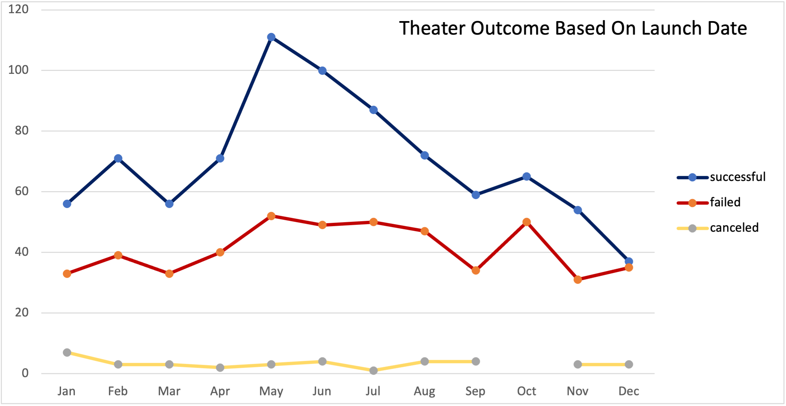
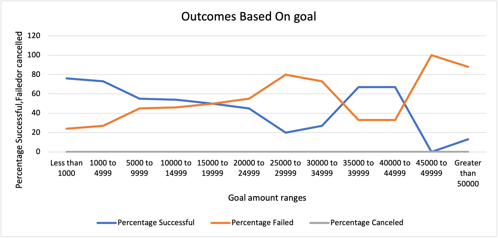
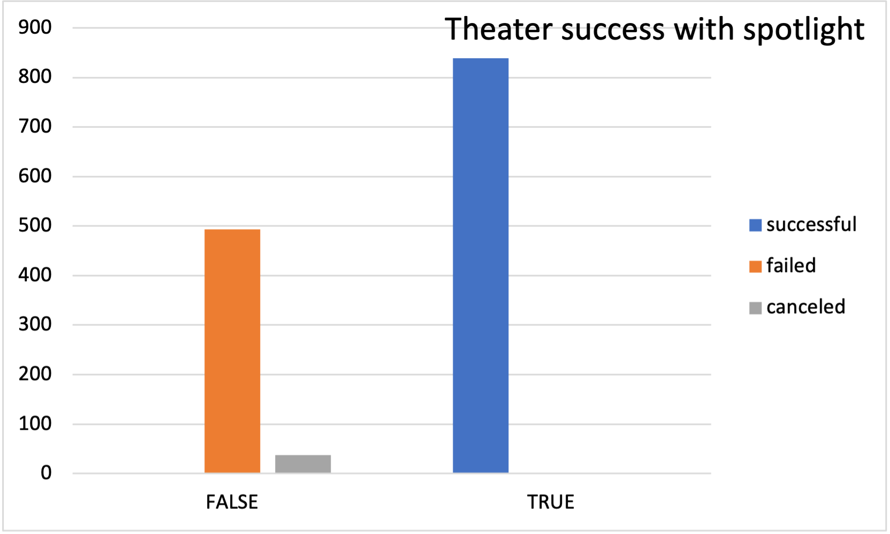
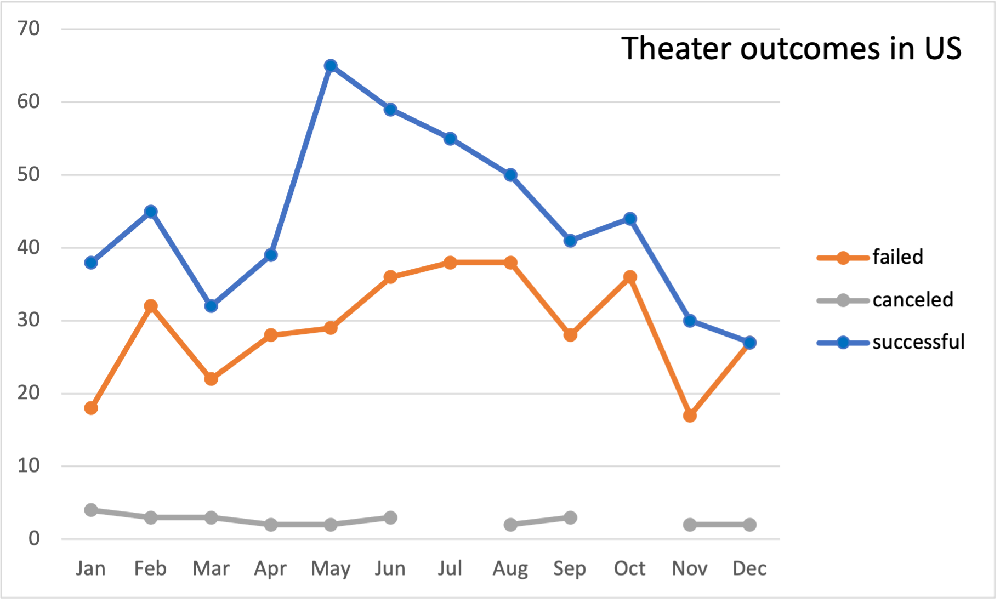
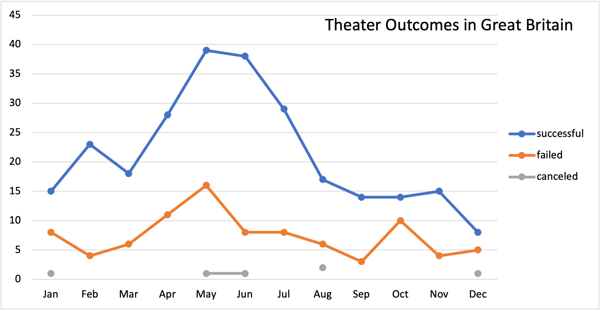
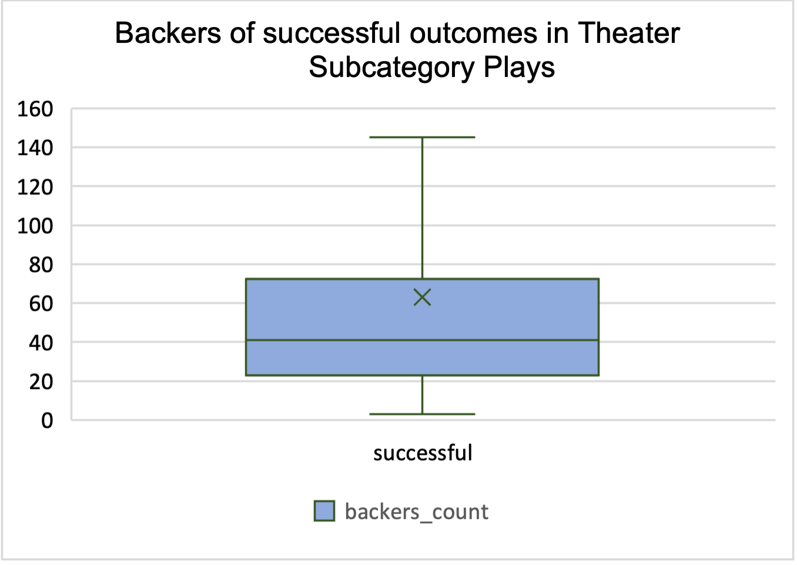
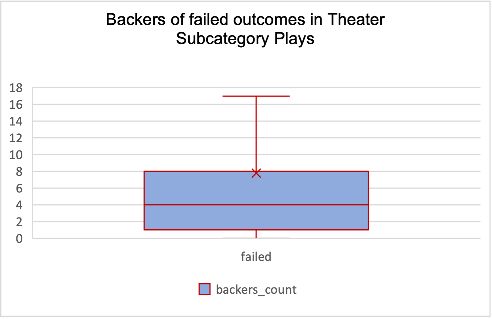

# Kickstarter_Analysis
Analysis of Kickstarter data using Excel

## Overview of Project
*"When I see Kickstarter, I don't see a company. Instead, I see a social movement. I see people doing things for people. I see small businesses that have been funded by their customers." By Om Malik*
* Kickstarter is a funding platform for creative projects.Every project creator sets their project's funding goal and deadline. If people like the project, they can pledge money to make it happen.This detailed dataset is about various kickstart projects in performing arts from various countries like US, Great Britain, Spain France etc. As a budding Data Analyst, I have been provided with the kickstarter dataset in Excel.I am expected to find interesting conclusions, visualize it in graphs and charts to demonstrate trends, patterns and relationships between sets of data.

### Purpose
* The purpose of this kickstarter Analysis is to provide insight into the kickstarter dataset and come up with interesting conclusions with graphs and charts that are intended to display the data in a way that is easy to understand and interpret. These graphs and charts would demonstrate trends, patterns and relationships between sets of data that would be helpful for the stakeholders who are interested in investing in a kickstarter program.

## Analysis and Challenges
### Analysis of Outcomes Based on Launch Date:
* I analyzed the outcomes based on launch date by using the parent filter and years in pivot table,I further narrowed the parent category to concentrate on theaters. I investigated the outcomes (successful, failed and canceled) based on launch date every month.This was followed by a graph that I created using line diagram that depicted the result that is easy to understand.I didn't face any challenge in working and analyzing this data.

### Analysis of Outcomes Based on Goals:
* I analyzed the outcomes based on goals by using COUNT IFS from Excel and further narrowing it to the goals range and specifying the outcomes as successful, failed and canceled. I further filtered the subcategory to plays to narrow down the data analysis. This was followed by a chart that I created using the goals in the X axis and the outcomes in the Y axis.
The challenge that I face here was to make sure that the range in the COUNT IFS was written correctly, if not then Excel does not identify the commands.

### Challenges and Difficulties Encountered
The challenges and difficulties that I faced was mainly in COUNT IFS where the fields had to be very precise, if not then Excel Ould return errors and I had to further look into it to rectify and make the necessary changes.

## Results

-What are two conclusions you can draw about the Outcomes based on Launch Date?

** Conclusion:1 **
There is a seasonal pattern in predicting the success of a Kickstarter campaign.
Most of successful campaigns are launched in early summer, in month of April and peak in May. Since most popular Kickstarter campaigns are related to performance arts like theatre and music, it makes sense to launch those campaigns in the summer months when schools are closed and families have more leisure time in hand and can enjoy with their families.There is a small peak seen in February as compared to January and March, this could be attributed to Valentine's Day that comes in February, when people tend to watch more plays, theater and musical shows.

** Conclusion:2 **
It is not a good time to start a Kickstarter campaign in the month of September as the success rate goes downhill from September.December is the worst month as it coincides with the end of the financial year. It is an uphill task to raise funds in the last quarter of the year (i.e. Oct – Dec). We can see that the failure rate is highest in October(43%). Similar trend is noticed for Kickstarter campaigns launched in the beginning of the financial year.

- What can you conclude about the Outcomes based on Goals?

* Kickstarter campaigns with goal less than 1000 dollars have a better chance at success. In fact, there seems to be a negative correlation between success rate and goal of the  Kickstarter campaign.There is a raised plateau seen in the 30,000 to 50,000 range, this could be attributed to star studded personalities participating in the theater.

- What are some limitations of this Dataset?
** Limitation 1:** This data set mainly covers European countries, North America. There is no data set from Asian subcontinent and South America or any other third word country.Any insight from these countries can he helpful as well.

** Limitation 2:** The success and failure of performing arts depends on the economy and the population of that place. There is no information about the population of the countries that are mentioned in the north 

- What are some other possible tables and/or graphs that we could create?

* I have also analyzed the use of spotlight on the possible outcome of campaigns. 
-All successful outcomes in kickstart campaign had spotlight, all failed outcomes did not have spotlight.

* Further, I compared the possible outcome of kickstart campaign based on launch date in USA with other countries mainly Great Britain.
-Although both USA and Great Britain has the most successful campaign launched in May but the number of theater launched in USA is way more (900)compared to Great Britain (353). In USA, the success peaks in May and gradually plummets down but in Great Britain there is a plateau in May and June and plummets in July.Interestingly, the success rate is higher in Great Britain (73%) as compared to USA (53%)

* I looked into the descriptive statistics of the successful and the failed outcomes. It is interesting to see that the standard deviation of successful outcomes is way higher (X75) than that of failed outcomes, meaning that the successful outcome data has higher variability. I also noticed that there are more backers in the successful outcomes(412) compared to failed outcomes (250). Another interesting fact is that around 18 backers is optimally needed for a successful campaign while most failed campaigns have a single backer. The median (mid-point) number of backers for successful outcome is 41 as compared to 4 for unsuccessful one. 

*"On an endnote Kickstarter campaigns can be successful only when it is supported by enthusiastic backers."*

